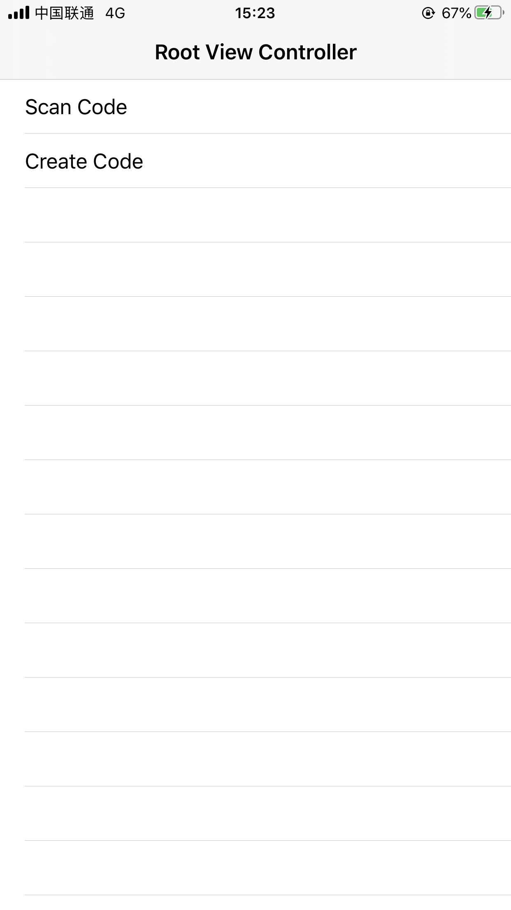

# Scan-Swift

## Introduction

Swift encapsulates AVFoundation code scanning and QR code image recognition functions.

* Can generate and recognize QR codes and bar codes
* Support for custom identification areas
* Support ScanView and ScanViewController overloading.
* Support for getting photo albums for image recognition (average results)


## Installation method

### CocoaPods

```ruby
pod 'Scan-Swift'
```


#### Swift Package Manager

```ruby
.package(url: "https://github.com/CainLuo/Scan-Swift.git", .upToNextMajor(from: "1.0.0"))
```


## Structure

* ScanView: A mask layer used to scan the interface, providing the area to be scanned.
* ScanManager: core class, mainly used to encapsulate the AVFoundation used to identify, generate Code methods, currently supported by `CIAztecCodeGenerator`, `CICode128BarcodeGenerator`, ` Generation of `CIPDF417BarcodeGenerator`, `CIQRCodeGenerator`.
* ScanResultModel: data obtained after scanning, obj can only be obtained when scanning, feature can only be obtained when recognizing image QR code.
* ScanConfigure: Used to configure some data when scanning, support some specific types of scanning.
* ScanError: the specific type of error to get if there is an error when scanning the code.
* ScanImageManager: image management class, with methods to add logos to the QR code, e.g.: zoom, crop
* PermissionManager: permissions management class, currently only have access to album permissions and camera permissions.


## Mode of use

It is recommended to use ScanViewController and ScanView to achieve custom control.


## Attention.

iOS 14 has enhanced privacy permissions, especially the new `Limited Photo Library Access` in PhotoLibrary, which will keep popping up a box if it doesn't work. PHPhotoLibraryPreventAutomaticLimitedAccessAlert`, and setting it to `YES` will fix it.


More detailed privacy rights adaptations can be found at: https://juejin.im/post/6850418120923250701


## Version

#### V1.0.0

* Support: Swift 5.3, iOS 10, Xcode 11


## Effects

   