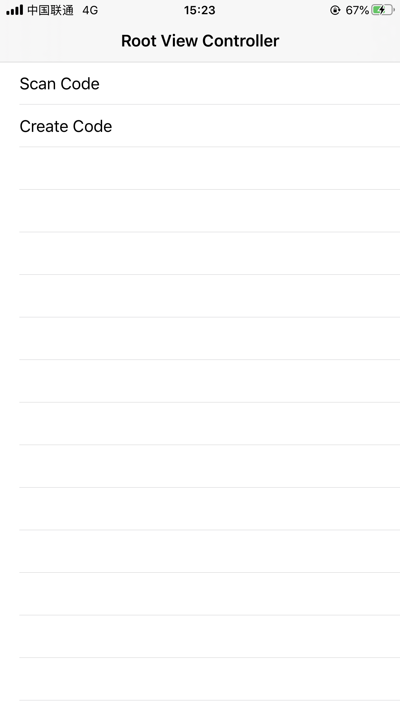
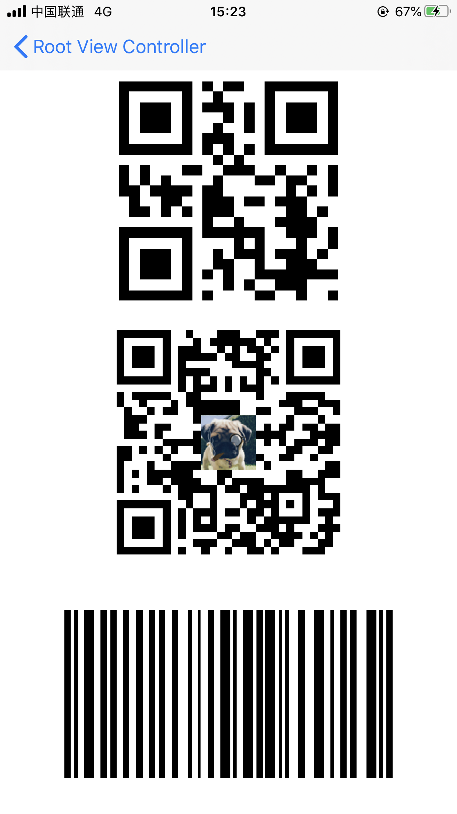

# Scan-Swift


## 介绍

Swift封装AVFoundation扫码以及识别二维码图片功能

* 可以生成与识别二维码、条形码
* 支持自定义识别区域
* 支持ScanView与ScanViewController的重载
* 支持获取相册图片识别(效果一般)


## 安装方式

### CocoaPods

```ruby
pod 'Scan-Swift'
```


#### Swift Package Manager

```ruby
.package(url: "https://github.com/CainLuo/Scan-Swift.git", .upToNextMajor(from: "1.0.0"))
```


## 结构

* ScanView: 用于扫码界面的蒙层, 提供指定扫码的区域
* ScanManager: 核心类, 主要用于封装AVFoundation用于识别、生成Code的方法, 目前支持的有`CIAztecCodeGenerator`、 `CICode128BarcodeGenerator`、`CIPDF417BarcodeGenerator`、`CIQRCodeGenerator`的生成
* ScanResultModel: 扫码后所获得的数据数据, obj只能在扫码时获得, feature只能在识别图片二维码时获得.
* ScanConfigure: 用于扫码时的一些配置, 支持扫码的一些具体类型
* ScanError: 用于扫码时有错误时获得的具体错误类型
* ScanImageManager: 图片的管理类, 有添加Logo到二维码的方法, 例如: 缩放, 裁剪
* PermissionManager: 权限管理类, 目前只有获取相册权限和相机权限


## 使用方式

推荐使用继承ScanViewController、ScanView来实现自定义控制.


## 注意

iOS 14加强了隐私权限, 特别是PhotoLibrary新增了`Limited Photo Library Access`, 如果没有适配则会一直弹框显示, 遇到这种情况可以在Info.plist中添加`PHPhotoLibraryPreventAutomaticLimitedAccessAlert`, 并设置为`YES`就可以解决.


更多详细的隐私权限适配可以查看: https://juejin.im/post/6850418120923250701


## 版本

#### V1.0.0

* 支持: Swift 5.3, iOS 10, Xcode 11


## 效果

   